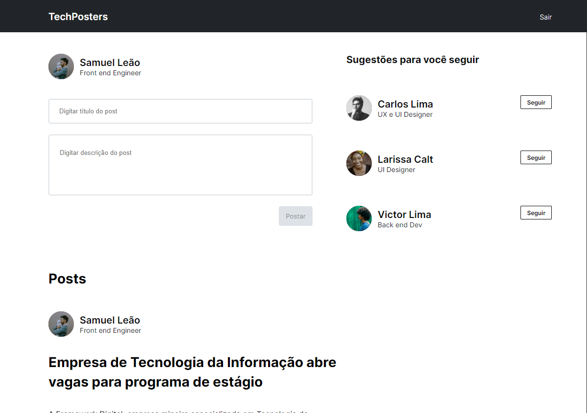
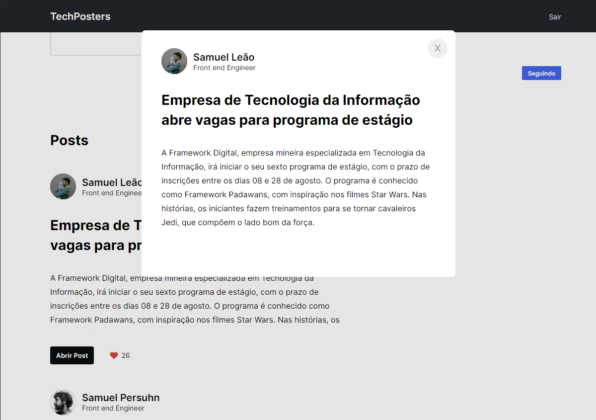

## TechPosters / isgabriel

A TechPosters se trata de uma rede social para os profissionais de TI se manterem informados com as notícias diárias publicadas pelos usuários que segue. É possível visualizar os posts em modais, ao clicar em "Abrir Post". Nesse projeto fixei meus conhecimentos sobre responsividade e mobile first, então é possível acessá-lo por qualquer aparelho eletrônico.

## Tecnologias

Aqui estão as tecnologias usadas nesse projeto:

-   HTML
-   CSS
-   Javascript

## Serviço usado

-   Github

## Como usar

 <h3>1 - Ao acessar a página, você verá a Home com os posts mais recentes</h3>
 

 <h3>2 - Ao clicar na aba de "Digitar descrição do post" o botão "Postar" é habilitado :)</h3>
 

 <h3>3 - Também tem a aba de sugestões para você seguir e o botão possui uma alteração de cor quando é clicado <3</h3>
 

 <h3>4 - Ao abrir post, um modal aparece na tela com o post completo</h3>
 

 <h3>5 - O botão de fechar modal também possui uma alteração de cor ao passar o mouse por cima</h3>
 

 <h3>6 - Ao clicar no coração em algum post, é possível visualizar que a contagem de curtida sobe e o coração fica vermelho</h3>
 

## Funcionalidades

As principais funcionalidades da aplicação são:

-   Visualizar modal de cada post da página.
-   Curtir/descurtir posts.
-   Seguir ou deixar de seguir usuários sugeridos
-   Layout responsivo para todos os tipos de aparelho.

## Links

-   Deploy: https://m2-rede-social-isgabriel.vercel.app
-   Repository: https://github.com/isgabriel/TechPosters

## Autores

-   <strong>Gabriel Fragoso Montenegro</strong>

Por favor, siga o github e junte-se a nós! Obrigado pela visita! <3

